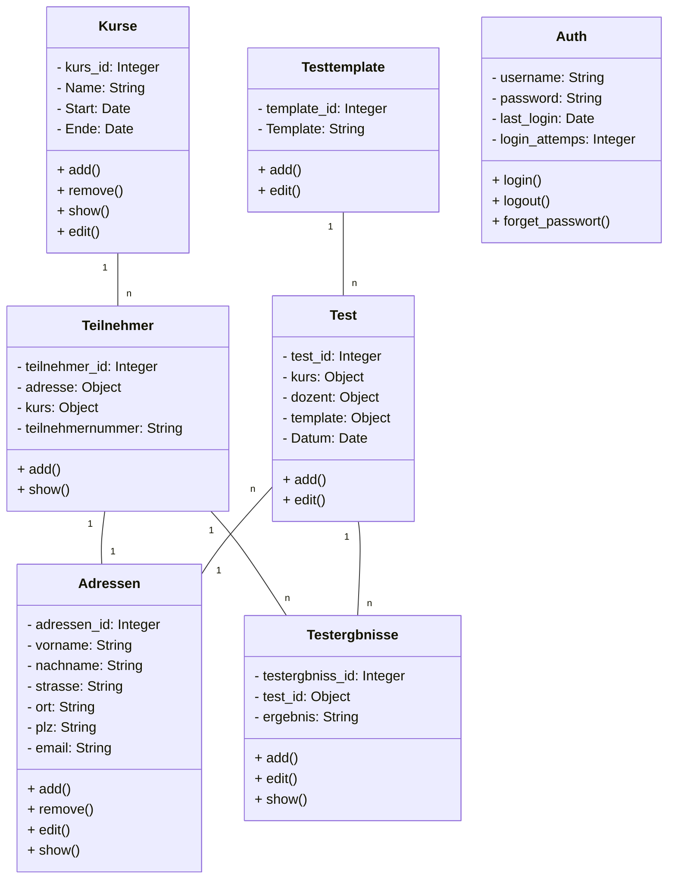

```mermaid
classDiagram


class Kurse{
    - kurs_id: Integer
    - Name: String
    - Start: Date
    - Ende: Date
    + add()
    + remove()
    + show()
    + edit()
}

class Teilnehmer{
    - teilnehmer_id: Integer
    - adresse: Object
    - kurs: Object
    - teilnehmernummer: String
    + add()
    + show()
}

class Adressen{
    - adressen_id: Integer
    - vorname: String
    - nachname: String
    - strasse: String
    - ort: String
    - plz: String
    - email: String
    + add()
    + remove()
    + edit()
    + show()
}

class Test{
    - test_id: Integer
    - kurs: Object
    - dozent: Object
    - template: Object
    - Datum: Date
    + add()
    + edit()
}

class Testergbnisse{
    - testergbniss_id: Integer
    - test_id: Object
    - ergebnis: String
    + add()
    + edit()
    + show()
}


class Testtemplate{
    - template_id: Integer
    - Template: String
    + add()
    + edit()
}

class Auth{
    - username: String
    - password: String
    - last_login: Date
    - login_attemps: Integer
    + login()
    + logout()
    + forget_passwort()
}

Kurse "1" -- "n" Teilnehmer
Teilnehmer "1" -- "1" Adressen
Teilnehmer "1" --  "n" Testergbnisse
Test "n" -- "1" Adressen
Test "1" -- "n" Testergbnisse
Testtemplate "1" -- "n" Test

```
