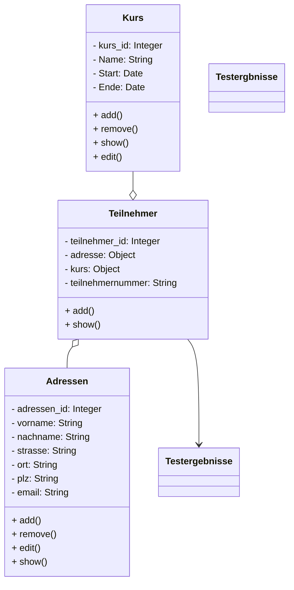

```mermaid
classDiagram


class Kurs{
    - kurs_id: Integer
    - Name: String
    - Start: Date
    - Ende: Date
    + add()
    + remove()
    + show()
    + edit()
}

class Teilnehmer{
    - teilnehmer_id: Integer
    - adresse: Object
    - kurs: Object
    - teilnehmernummer: String
    + add()
    + show()
}

class Adressen{
    - adressen_id: Integer
    - vorname: String
    - nachname: String
    - strasse: String
    - ort: String
    - plz: String
    - email: String
    + add()
    + remove()
    + edit()
    + show()
}

class Testergbnisse{

}

Kurs --o Teilnehmer
Teilnehmer o-- Adressen
Teilnehmer --> Testergebnisse

```
